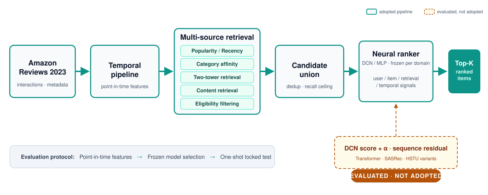
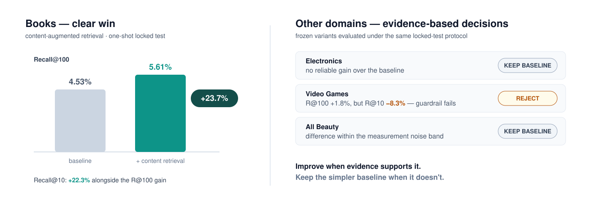
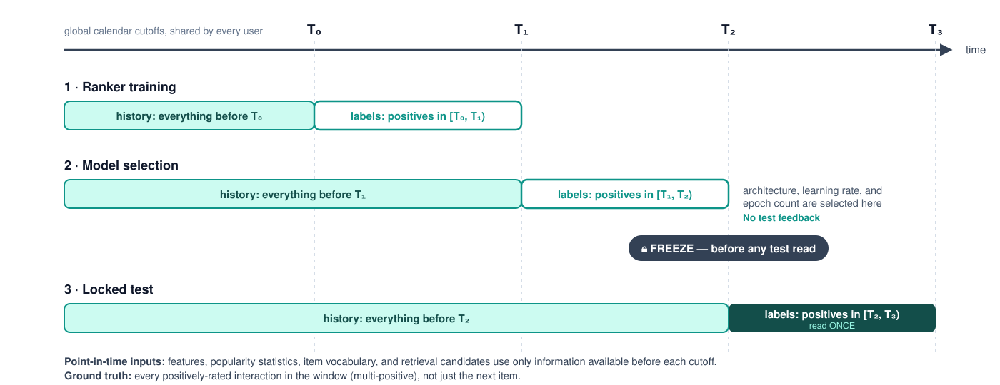

# Temporal Two-Stage Recommendation System

**A production-oriented recommender built on Amazon Reviews 2023 with global-time evaluation, multi-source retrieval, neural ranking, and sequential modeling.**

    

This repository implements an industrial-style two-stage recommender across
four Amazon Reviews 2023 domains, combining multi-source candidate retrieval
with neural ranking under strict global-time evaluation.

Unlike next-item evaluation, every positively rated interaction in the future
window contributes to a multi-positive ground truth. Retrieval and ranker
choices are frozen before a one-shot test read.

**Headline result: content-augmented retrieval improves Books Recall@100 from
4.53% → 5.61% (+23.7%) and Recall@10 by +22.3%.**

## System Architecture



## Key Results

Locked-test window, overall recall (denominator = all ground-truth users).
The frozen variant is the configuration selected *before* the test read.

| Domain | Baseline R@10 | Frozen Variant R@10 | Baseline R@100 | Frozen Variant R@100 | Final Decision |
|---|---:|---:|---:|---:|---|
| Books | 2.66% | **3.25%** | 4.53% | **5.61%** | **Adopt content-augmented retrieval** |
| Electronics | 3.17% | 3.17% | 9.51% | 9.51% | Keep baseline |
| Video Games | 5.30% | 4.86% | 14.46% | 14.71% | Keep baseline — R@10 guardrail fails |
| All Beauty | 3.04% | 3.08% | 12.13% | 11.92% | Keep baseline — within noise |

Only improvements that survived the locked-test protocol and ranking
guardrails were adopted. The frozen decisions, their inputs and the exact
selection rule are recorded with hashes in
[`results/p4_freeze/frozen_config_ap.json`](results/p4_freeze/frozen_config_ap.json).



## Why Global Time Matters



Four calendar cutoffs `T0 < T1 < T2 < T3` are fixed per domain. Models train
on history before T0 with labels from [T0, T1); architecture, learning rate
and epochs are selected on labels from [T1, T2); the window [T2, T3) is read
once per declared evaluation.

- **Point-in-time correctness.** Features and retrieval candidates may only
  use information available before the corresponding cutoff — including item
  popularity, feature statistics, and the item vocabulary itself.
- **Multi-positive ground truth.** All observed positively-rated interactions
  in the future window contribute to ground truth, and label-frame integrity
  is enforced by a bidirectional training-time assertion.
- **One-shot locked test.** Retrieval configuration and ranker recipe are
  frozen, with recorded provenance, before test evaluation.

## Two-Stage Recommendation Pipeline

### Stage 1 — Candidate Retrieval

Per-source top-K lists are unioned and deduplicated per user: lifetime
popularity, recency-weighted popularity, a store/category affinity rule,
a two-tower model (in-batch softmax with a user-history "taste" channel),
and a text-embedding content source over the item catalog. An eligibility
threshold controls which items may be retrieved at all.

> Ranking cannot recover relevant items that retrieval never surfaces.

That bound is measured explicitly:

$$\text{Candidate Recall Ceiling} = \frac{1}{|U|}\sum_{u}\frac{|C_u \cap G_u|}{|G_u|}$$

— the maximum macro recall attainable by any ranker given the materialized
candidate set (`C_u` is the candidate union, `G_u` the user's future
positives). Books is where content retrieval pays off: many future positives
have no pre-cutoff interaction evidence, making metadata-based retrieval
particularly valuable. The ~21% relative increase in candidate coverage
closely tracks the +23.7% end-to-end Recall@100 improvement, pointing to
retrieval coverage as the dominant bottleneck.

### Stage 2 — Ranking

Candidates are re-ranked with a neural ranker selected per domain from MLP
and Deep & Cross Network (DCN) architectures, using user, item, retrieval,
and temporal signals. Feature categories (exact lists live in
[`scripts/ranker/train_temporal_ranker.py`](scripts/ranker/train_temporal_ranker.py)):

- User history (counts, ratings, activity recency)
- Item statistics (history-windowed, point-in-time)
- Retrieval-source signals (per-source membership, ranks, scores)
- User–item interactions (store/category affinity crosses)
- Temporal features (recent-activity windows)

Architecture and learning rate are chosen on the selection snapshot only;
the frozen recipe (architecture, learning rate, epoch count) is retrained
exactly for the locked test.

## Sequential Recommendation Experiment

**Do Transformers improve the ranker?**

Sequence models were evaluated as incremental residual additions to a frozen
DCN baseline rather than as replacements:

$$s(u,i) = s_{\mathrm{DCN}}(u,i) + \alpha \, s_{\mathrm{seq}}(u,i), \qquad \alpha \text{ initialised at } 0$$

so the model starts exactly at the DCN baseline (asserted by a structural
test) and learns sequence information only through an incremental residual
branch. Variants
evaluated over the user's last 20 pre-cutoff interactions, with absolute-time
and interaction-gap positional encodings:

- vanilla bidirectional sequence encoder
- target-aware multi-head pooling
- causal (SASRec-style) last-state encoder
- HSTU-style gated-attention variant
- SASRec anchor runs on the standard public benchmark protocol

Three configurations per domain were preregistered, and the tie band was
defined by two seeds of the baseline itself.

**Result: no sequence configuration produced a sufficiently robust
incremental R@100 gain to justify adoption.**

SASRec achieved R@10 = 0.091 on the anchor benchmark (5-core Video Games,
leave-one-out), within the literature reference band [0.070, 0.097] documented in
[`results/anchor/COMPARISON.md`](results/anchor/COMPARISON.md) —
evidence that the negative result under the production-style evaluation
protocol was not simply caused by a broken implementation. In these Amazon Reviews domains, the median observed sequence length is
only 1–2 events, and the DCN's engineered features already carry most of
what short sequences encode.

## Engineering Lessons

- **Retrieval can dominate ranking.** The Books gain comes almost entirely
  from candidate coverage, not from a better scorer.
- **Evaluation objectives change conclusions.** Next-item-style evaluation
  and multi-positive future coverage answer different questions — changing
  from first-positive to multi-positive evaluation materially changed
  model-selection conclusions.
- **More complex models are not automatically better.** Neither the sequence
  variants nor the two-tower upgrade reliably beat strong simple baselines
  end to end.
- **Negative experiments need validation too.** The anchor benchmark, seeded
  noise bands, and the locked test are what make "no improvement" a
  defensible conclusion rather than an absence of evidence.

More incidents and their fixes: [docs/engineering-notes.md](docs/engineering-notes.md) · How the system evolved April → August: [docs/HISTORY.md](docs/HISTORY.md).

## Reproducibility / Quick Start

```bash
git clone https://github.com/jiwu9610/temporal-two-stage-recommender.git
cd temporal-two-stage-recommender
pip install -r requirements.txt
python -m pytest tests/
```

1. **Prepare Amazon Reviews data** — [`scripts/data/`](scripts/data/) (download, canonicalize, filter)
2. **Build temporal snapshots** — [`slurm/p2_chain.sbatch`](slurm/p2_chain.sbatch) → point-in-time feature tables
3. **Run retrieval** — [`slurm/p4_stageA.sbatch`](slurm/p4_stageA.sbatch) with configs in [`configs/p4_stageA/`](configs/p4_stageA/)
4. **Freeze the Stage-B configuration** — [`scripts/analysis/p4_freeze_ap.py`](scripts/analysis/p4_freeze_ap.py) (pure-read, pre-declared rule)
5. **Run the locked test** — [`slurm/p5_locked_test.sbatch`](slurm/p5_locked_test.sbatch) (consumes the frozen recipe)
6. **Optional: sequence experiments** — [`slurm/w3_seq_selection.sbatch`](slurm/w3_seq_selection.sbatch) with [`results/wave3_seq_v2/PREREGISTRATION_v2.md`](results/wave3_seq_v2/PREREGISTRATION_v2.md)

Slurm site values (allocation, partitions) are placeholders — see
[`slurm/README.md`](slurm/README.md). Raw Amazon Reviews data and generated
model checkpoints are intentionally not committed.

## Repository Structure

```
scripts/
  data/        canonicalization, temporal snapshots, feature tables
  retrieval/   candidate sources, two-tower models
  ranker/      candidate builder, MLP/DCN rankers, sequence module
  evaluation/  multi-positive metrics, calibration
  anchor/      literature-anchor benchmark runs
  analysis/    Stage-A gate, freeze script, audits
configs/       retrieval sweep + frozen per-domain configurations
results/       reports and metrics (entry: results/REBUILD_WAVE_REPORT.md)
docs/          engineering notes · project evolution · figures
slurm/         batch drivers for every stage
tests/         pytest suite
archive/       superseded phases and invalidated artifacts, clearly marked
```

## Limitations

- **Catalog availability.** The Books content result assumes metadata-catalog
  items were available at the historical cutoff, because Amazon Reviews does
  not provide reliable historical listing timestamps; 85.2% of the items hit
  only by the content source have no interaction evidence before the test
  cutoff. The headline is stated under this assumption.
- **Review ≠ purchase.** Positive ratings are used as observed positive
  interactions; the dataset is not a complete purchase log, and cross-day
  repeat interactions are rare enough (≤0.23% of raw rows) that repeat
  recommendation is out of scope by construction.
- **Offline evaluation.** This project evaluates an offline recommendation
  pipeline; it does not implement a live serving stack or an online feature
  store.

---

*The project emphasizes not only model quality, but also temporal
correctness, reproducible model selection, failure analysis, and
evidence-based decisions about when **not** to deploy additional model
complexity.*
